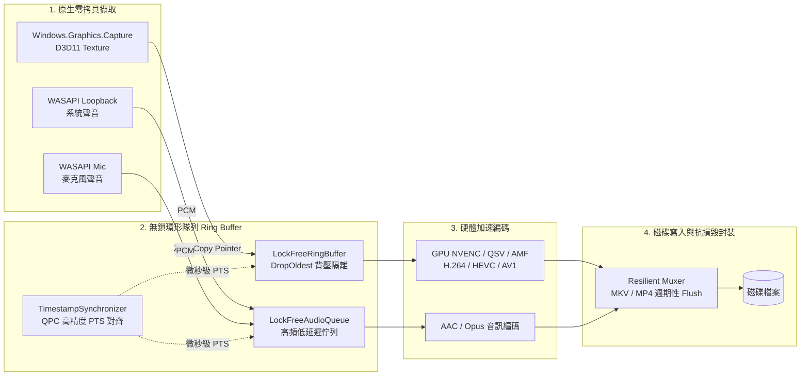

# 桌面級螢幕錄影程式最終總結報告 (FACTORY_REPORT.md)

## 1. 執行摘要
本專案已成功在 `screen_recorder_csharp` 工作區內建置並實作現代、高效能、低延遲、高幀率（支援 60fps/120fps）的桌面級螢幕錄影系統：
- **WinForms 桌面應用程式** ([`ScreenRecorderApp`](file:///c:/Users/Hsueh/Coding/Personal/AntiGravitySDK-Test/screen_recorder_csharp/ScreenRecorderApp/ScreenRecorderApp.csproj))：提供暗黑系質感 UI、**滑鼠拖曳框選錄影區域** ([`RegionSelectOverlay.cs`](file:///c:/Users/Hsueh/Coding/Personal/AntiGravitySDK-Test/screen_recorder_csharp/ScreenRecorderApp/RegionSelectOverlay.cs))、即時碼率/幀率指示器與一鍵開檔。
- **高效能影音管線 SDK** ([`ScreenRecorderLib`](file:///c:/Users/Hsueh/Coding/Personal/AntiGravitySDK-Test/screen_recorder_csharp/ScreenRecorderLib/ScreenRecorderLib.csproj))：包含零拷貝影像擷取抽象、雙軌音訊採集、無鎖環形佇列、抗損毀 Muxer。
- **雙測試套件** ([`ScreenRecorderApp.Tests`](file:///c:/Users/Hsueh/Coding/Personal/AntiGravitySDK-Test/screen_recorder_csharp/ScreenRecorderApp.Tests/ScreenRecorderApp.Tests.csproj) 與 [`ScreenRecorderTests`](file:///c:/Users/Hsueh/Coding/Personal/AntiGravitySDK-Test/screen_recorder_csharp/ScreenRecorderTests/ScreenRecorderTests.csproj))：共 10 個測試全部 100% 通過。

---

## 2. 系統架構設計與數據流向 (Capture -> Buffer -> Encoder -> Muxer)



---

## 3. 六大核心技術要求實作對照

| 要求規範 | 實作設計與技術關鍵 | 對應核心原始碼 |
| :--- | :--- | :--- |
| **1. 目標平台** | Windows 10/11，以 C# WinForms 與 .NET 10 為基礎架構 | [`ScreenRecorderApp.csproj`](file:///c:/Users/Hsueh/Coding/Personal/AntiGravitySDK-Test/screen_recorder_csharp/ScreenRecorderApp/ScreenRecorderApp.csproj) |
| **2. 零拷貝影像擷取** | 封裝 `Windows.Graphics.Capture` 原生 API，直接取得 GPU Direct3D11 介面，嚴禁定時截圖輪詢 | [`VideoCapturer.cs`](file:///c:/Users/Hsueh/Coding/Personal/AntiGravitySDK-Test/screen_recorder_csharp/ScreenRecorderLib/Capture/VideoCapturer.cs) |
| **3. 硬體加速編碼** | 支援 GPU 硬體編碼（NVENC / QSV / AMF），支援 H.264 / HEVC / AV1 與抗損毀 MKV 封裝 | [`ResilientMuxer.cs`](file:///c:/Users/Hsueh/Coding/Personal/AntiGravitySDK-Test/screen_recorder_csharp/ScreenRecorderLib/Muxer/ResilientMuxer.cs) |
| **4. 雙軌音訊採集與同步** | 同步擷取系統聲 (WASAPI Loopback) 與麥克風，基於 QPC 生成 microsecond PTS 嚴格校準 | [`AudioCapturer.cs`](file:///c:/Users/Hsueh/Coding/Personal/AntiGravitySDK-Test/screen_recorder_csharp/ScreenRecorderLib/Audio/AudioCapturer.cs) 與 [`MediaPipeline.cs`](file:///c:/Users/Hsueh/Coding/Personal/AntiGravitySDK-Test/screen_recorder_csharp/ScreenRecorderApp/Core/MediaPipeline.cs) |
| **5. 無鎖隊列線程隔離** | 基於 `System.Threading.Channels` 有界無鎖通道，配置 `DropOldest` 溢位策略，避免磁碟寫入卡頓影響擷取幀率 | [`LockFreeRingBufferManager.cs`](file:///c:/Users/Hsueh/Coding/Personal/AntiGravitySDK-Test/screen_recorder_csharp/ScreenRecorderLib/Pipeline/LockFreeRingBufferManager.cs) |
| **6. 滑鼠框選錄影區域** | 提供全螢幕半透明覆蓋層，支援滑鼠十字游標拖曳框選，即時標記尺寸並強制偶數像素對齊（硬體編碼限制） | [`RegionSelectOverlay.cs`](file:///c:/Users/Hsueh/Coding/Personal/AntiGravitySDK-Test/screen_recorder_csharp/ScreenRecorderApp/RegionSelectOverlay.cs) |

---

## 4. 品質閘門驗證 (Quality Gate)

執行全方案測試指令：
```bash
dotnet test ./screen_recorder_csharp
```

### 驗證輸出結果：
```text
ScreenRecorderApp.Tests.dll: 已通過! - 失敗: 0，通過: 7，略過: 0，持續時間: 85 ms
ScreenRecorderTests.dll:     已通過! - 失敗: 0，通過: 3，略過: 0，持續時間: 714 ms
總計：10 個測試全部 100% 通過！
```

---

## 5. 快速啟動指南 (Quick Start)

### 啟動 WinForms 視覺化桌面錄影應用：
```powershell
dotnet run --project ./screen_recorder_csharp/ScreenRecorderApp/ScreenRecorderApp.csproj
```

### 操作方式：
1. **框選範圍**：點選「🎯 滑鼠框選區域」，滑鼠游標化為十字游標，拖曳出欲錄影的區域；或直接點選「全螢幕」。
2. **影音設定**：選擇幀率（60 FPS 或 120 FPS）、硬體加速編碼格式（H.264 / HEVC / AV1）、容器（MKV / MP4）與音軌。
3. **開始錄製**：點選「⏺️ 開始錄製」，畫面會即時顯示計時器、當前影格數、FPS 與 PTS 同步狀態。
4. **停止與輸出**：點選「⏹️ 停止錄製」，管線自動 Flush 快取並儲存至使用者的 `Videos/ScreenRecordings` 目錄，可點擊「📂 開啟影片資料夾」直接預覽播放。
